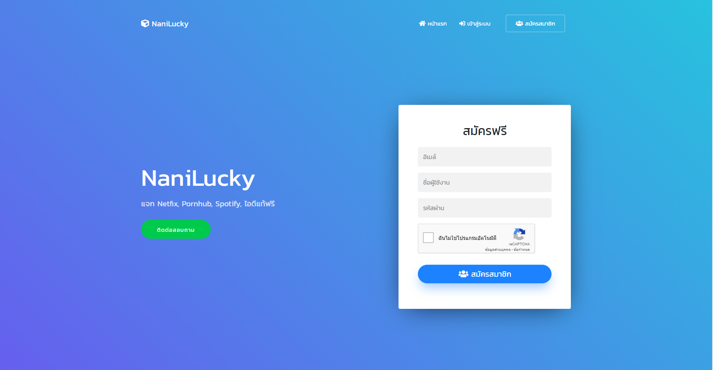

# NaniLucky Script
สคริปเว็บเก็บแต้มแลกของ ปล.ทำไว้นานแล้ว




## หน้าที่ต้องแก้ไข connect.php
```php
try {
$engine = new PDO("mysql:host=127.0.0.1;dbname=nani_lucky;charset=utf8", "nani_lucky",""); <- เปลี่ยนรหัสผ่าน
$engine->exec("set names utf8");
}
catch (PDOException $e) {
	 echo '<b>เชื่อมต่อผิดพลาด -> </b>'.$e->getMessage();
	 exit;
}

$mysql = mysqli_connect("localhost","nani_lucky","","nani_lucky"); <- เปลี่ยนรหัสผ่าน

if (mysqli_connect_errno())
  {
  echo "Failed to connect to MySQL : " . mysqli_connect_error();
  }
  ```
  
# Support Me :D
support this project by make a donation to project developer.<br>
สนับสนุนโปรเจคได้โดยการโดเนทในคนทำ กี่บาทกะได้ 555+<br>
[Paypal (paypal.me/lolipopkungz)]( https://www.paypal.me/lolipopkungz "Focus Dev")<br>
